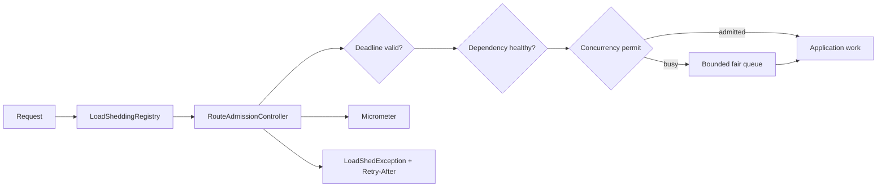
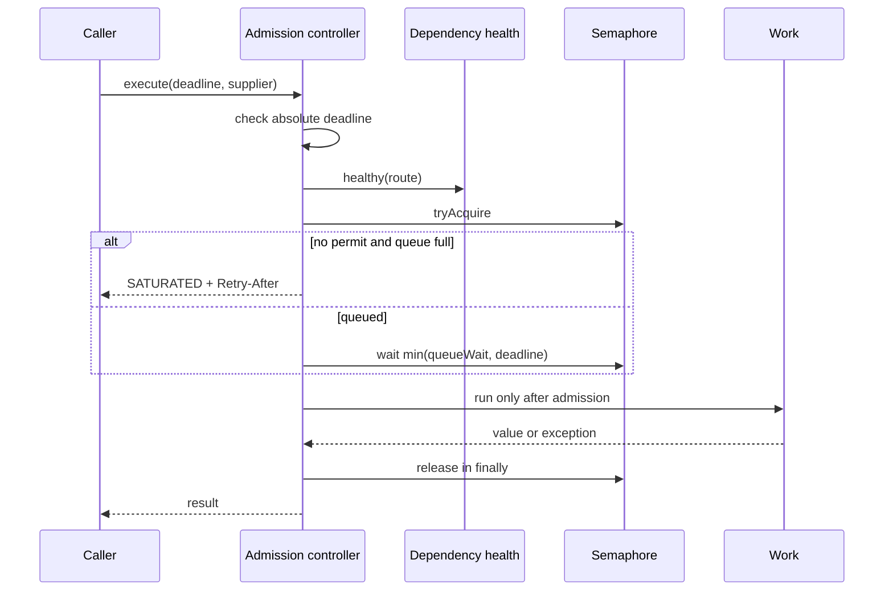

# Spring Load Shedding

Spring Load Shedding provides explicit per-route admission control for Java and Spring services. It combines fair concurrency limits, bounded waiting, request deadlines, dependency-health signals, Retry-After guidance, rejection reasons, and Micrometer metrics.

## Problem Statement

Accepting every request during saturation grows queues, misses deadlines, amplifies retries, and pressures dependencies until the service fails. Admission must happen before expensive work and should explain why a request was rejected.

## What This Project Solves

- independent concurrency limits per route
- bounded fair queues with maximum wait times
- absolute request deadlines
- dependency-health admission hooks
- stable rejection reasons and Retry-After duration
- permit cleanup on success and failure
- active and queued state inspection
- Micrometer admission and rejection counters
- compatibility with platform and virtual threads

## When To Use It

Use it around expensive endpoint or dependency work when excess load should fail quickly instead of accumulating. Set limits from measured service capacity and latency objectives; CPU percentage alone is not an admission policy.

## Architecture / HLD



## Detailed Design / LLD



The queue count is reserved before blocking and decremented in `finally`. Work permits are also released in `finally`, preventing capacity leaks when application code throws.

## Public API / API Structure

| Type | Purpose |
| --- | --- |
| `RoutePolicy` | Concurrency, queue capacity, wait, and retry guidance |
| `RouteAdmissionController` | Admission and guarded execution for one route |
| `LoadSheddingRegistry` | Per-route policy selection |
| `DependencyHealth` | Route-aware health signal |
| `LoadShedException` | Rejection reason and Retry-After duration |
| `SheddingMetrics` | Admission/rejection hook |
| `MicrometerSheddingMetrics` | Counter implementation |

## Core Concepts

Admission order is deadline, dependency health, immediate permit, then bounded queue. No rejected request invokes its work supplier. Queue wait is capped by both policy and the remaining request deadline.

The implementation uses a fair `Semaphore`, which blocks virtual threads without tying up platform threads. It intentionally omits an opaque adaptive mode; policy changes remain an application control-plane decision.

## Local Prerequisites

- JDK 21 or newer
- Git

The Maven Wrapper pins Maven 3.9.12.

## Steps To Run

```bash
git clone https://github.com/aniket-deshkar/spring-load-shedding.git
cd spring-load-shedding
./mvnw verify
```

Use `mvnw.cmd verify` on Windows.

## Configuration

Configure each stable route name independently. `queueCapacity=0` rejects immediately when all permits are occupied. Set an explicit max queue wait and translate `retryAfter()` to an HTTP `Retry-After` header at the web boundary.

## Usage Examples

```java
LoadSheddingRegistry shedding = new LoadSheddingRegistry(
    Map.of(
        "search", new RoutePolicy(40, 20, Duration.ofMillis(100), Duration.ofSeconds(1)),
        "checkout", new RoutePolicy(10, 0, Duration.ZERO, Duration.ofSeconds(2))),
    Clock.systemUTC(),
    route -> dependencyHealth.isHealthy(route),
    new MicrometerSheddingMetrics(meterRegistry));

SearchResult result = shedding.execute(
    "search",
    requestDeadline,
    () -> searchService.search(query));
```

Map `SATURATED`, `QUEUE_TIMEOUT`, and `DEPENDENCY_UNHEALTHY` to the service's overload response. Preserve the stable reason in logs and metrics.

## Testing

Run `./mvnw verify`. Eight deterministic tests cover concurrency plus one bounded waiter, immediate saturation, queue timeout, expired deadlines, unhealthy dependencies, exception cleanup, unknown routes, invalid policies, and a 20-request virtual-thread load where active work never exceeds three. Spotless and PMD run in Java 21 CI.

## Observability

`MicrometerSheddingMetrics` emits `load.shedding.requests` tagged by route, outcome, and rejection reason. Route names must remain low-cardinality. Monitor rejection ratio alongside active work, latency, dependency health, and upstream retry behavior.

## Security

Admission control is not authorization. Authenticate and apply cheap request validation before expensive work while ensuring authorization semantics remain correct. Do not leak internal dependency state in public error bodies; translate reason codes deliberately.

See [SECURITY.md](SECURITY.md).

## Repository Structure

```text
src/main/java/.../loadshedding/   Policies, controllers, registry, metrics
src/test/java/.../loadshedding/   Deterministic virtual-thread load tests
.github/workflows/ci.yml          Java 21 quality gate
pom.xml                           Build and dependency configuration
```

## Design Decisions / Trade-offs

- Fixed explicit limits are explainable and stable but require operational tuning.
- Fair semaphores reduce starvation at a small throughput cost.
- Queues are bounded per process; a multi-instance service applies capacity independently at each instance.
- Dependency health is a hook rather than CPU-driven inference, keeping the rejection signal application-specific.

## Contributing

Follow [CONTRIBUTING.md](CONTRIBUTING.md) and include controlled-load evidence for admission changes.

## License

Apache License 2.0. See [LICENSE](LICENSE).
